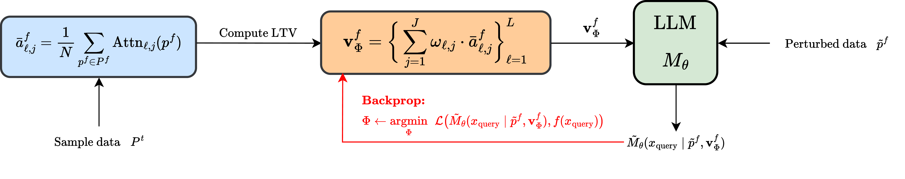

# Learning Task Representations from In-Context Learning


## Getting Started

#### 1. Dependencies
Install the dependencies using Conda. You may need to adjust the environment YAML file (such as the name, Python version, etc.) depending on your setup.
```
conda env create -f environment.yml
conda activate icl-task-repr
```

#### 2. Use the forked ``transformers`` package 

A couple of lines have been added to [``modeling_gpt2.py``](https://github.com/huggingface/transformers/blob/main/src/transformers/models/gpt2/modeling_gpt2.py) to track the attention output for computing/adding the LTV. This won't effect the operation of the package. 
```
cd ICL-Task-Representations
cd transformers
pip install .
```

**Note:** Our method works on two modalities: numeric functions (synthetic tasks) and language. For functions, we use the [code](https://github.com/dtsip/in-context-learning) from [Garg et al.](https://arxiv.org/abs/2208.01066), while the [code](https://github.com/ericwtodd/function_vectors) of [Todd et al.](https://functions.baulab.info/) is utilized for the linguistic tasks. So we examine the requirements for functions and language separetely. 

## Training a Learnable Task Vector

### 1. Synthetic Tasks
#### 0. Load the trained GPT-2 models
We use the models trained by [Garg et al.](https://arxiv.org/abs/2208.01066). This training is somewhat different than the generic pretraining of GPT-2. They just simply slightly modify the architecture by adding a linear layer to preprocess numbers. Refer to the paper for more details.
```
cd synthetic
wget https://github.com/dtsip/in-context-learning/releases/download/initial/models.zip
unzip models.zip
```

#### 1. Train a Learnable Task Vector [optional]
Train a task vector on a specified function class. This will first generate a dataset of size being typically $100 \times \texttt{batch size}$. Then the LTV layer will be trained on this dataset. An example usage:
```
cd src
python train_LTV.py --task linear_regression --seq_len 71 --batch_size 512 --lr 5e-5
```

#### 2. Perform inference of the trained Learnable Task Vector
Perform inference of: vanilla GPT-2, GPT-2 + Function Vectors (benchmark), and GPT-2 + Learnable Task Vector. Inference takes time so the predictions will be saved. You can specify the distributional shift:
```
python LTV_inference.py --dist_shift skewed
```
If nothing passed, no distributional shift will be applied.

#### 3. Plot the results
Plot the loss curves based on the saved predictions. You need to specify the type of distributional shift once again:
```
python LTV_plot.py --dist_shift noisy_linear_regression
```

### 2. Language Tasks
#### 1. Train a Learnable Task Vector [optional]
```
python train_LTV.py --dataset antonym --n_examples 10 --batch_size 256
```

#### 2. Perform inference of the trained Learnable Task Vector
Inference is performed over the specified tasks (as a list) separately. ``n_trials`` specifies the number of times that the transformers are queried.
```
python LTV_inference.py --task_names antonym, synonym --prompt_type zero-shot --n_trials 256
```

### Demo Notebooks
Notebooks to play around can be found in each task's respective directory, under the name ``LTV_demo.ipynb``.
